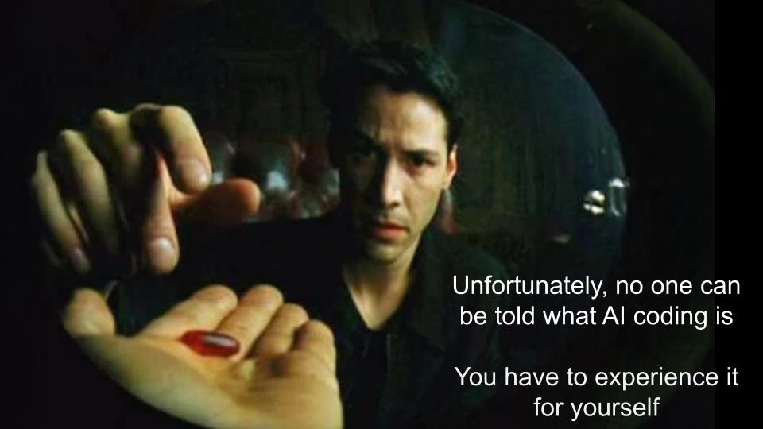

### Presentation for AICSEPAR 2026

# A Mini-Course to Get CS Students Up to Speed: Effective use of AI Coding Tools: CMSC 398z

## Bill Pugh, Univ. of Maryland
### As of 2012, Emeritus Professor of Computer Science

### Course web page: https://www.cs.umd.edu/class/fall2025/cmsc398z
### Git repository: https://github.com/billpugh/cmsc398z-student-downloads

---

# We *need* to be having a much bigger conversation

AI coding tools are going to fundamentally change how software gets developed 
* Maybe by just *a lot*, maybe by *much more* than that

We need to try to understand where the puck *is* if we want to have any hope of understanding where it might go
* AI coding tools that 'reason', use tools and iterate (agentic?)

Skills often not covered/required in the CS undergraduate curriculum will become essential for students to get software development internships or jobs
* Not just "How to use AI tools"
* *See next talk*: [What do professional software developers need to know to succeed](https://dl.acm.org/doi/10.1145/3696630.3727251) ...

---

---

# I'm not saying we can stop teaching coding

I've become pretty good at using AI coding tools to build software
* I no longer type source code, or even review it
* I now work at a higher level of abstraction, very involved in design and validation
  * Claude has typed 30,000 lines of python, 2,500 lines of rust over the past month for me on a side project
* I've been coding for 53 years and internalized a lot of concepts about software design, algorithms and software architecture
  
I don't know if coding without AI tools is important to learning those concepts 

---
# Back to our originally scheduled presentation  

CMSC 398z: A 1 credit course for Fall 2025 that I decided to offer in June

Started trying to get up to speed myself starting in May

No committee approval needed. 2 hour lab sessions each Friday, no coding expected outside of class

Course goals: try to help student see what AI coding tools were capable of, and what teaching that to students would be like

By great fortune, Derek Willis, an instructor from the Journalism school, already somewhat proficient in use of AI for data and analytics reporting, contacted me about my course and I talked him into being a co-instructor

  
---

# Materials from my course are already out of date

If I taught the same course again this semester, I would  significantly revise it 
* due to how much AI coding tools have changed in six months

Bigger changes would be appropriate by next fall

The goals of what I did in the class and non-AI topics we covered are still largely appropriate 
* python, json, schemas, noisy data, non-deterministic processing, verifying results
* Getting AI tools to work as tutors rather than answer machines

---
# This is moving so damn fast

* Discussions I had at Google and Microsoft in May '25 were out of date by beginning of semester
  * Even course title was out of date
  * Smart autocomplete no longer interesting/relevant
* September: Claude Sonnet 4.5 was a huge step up in capability
* Late November: Claude Opus 4.5 another huge step up. Some professional software developers started using it to write 90-99% of their code
* February 26: Claude Opus 4.6 and OpenAI Codex 5.3 were another leap forward
* March 13: 1M context in Claude generally available
* By next Fall 2026: ???
* By Spring 2030: ?????

---
# Course Goals

* Get students familiar with the kinds of programming tasks AI coding tools excel at
  * Python, databases, markdown, json, schemas, etc
* Projects generally open ended, incompletely specified
* All coding in class to avoid students getting stuck
* Get them access to several different coding models
  * Initially, GitHub for education, free for students
  * Considered several other options for agentic AI tools, settled on Claude
  * Told students they should just plan to spend $20/month for 2 months to get access
    * Students can get free access by attending Claude Builders club meeting on campus

---

# Learning Python and using AI tools - 3 weeks / 6 hours

* Provided `.github/copilot-instructions.md`  to stop AI from just giving answers
  * Autocomplete in VSCode+Copilot ignores `copilot-instructions.md`
  * would often complete functions just from function name
  * had to disable autocomplete
* Finding and utilizing libraries is a core talent of AI coding tools
* Playing Wordle, using termcolor library
  * extension: Wordle helper
* Markov Text Generation
* Poker hand analysis - what is the best hand I can make from these 7 cards?
  * extension: What are my chances of winning with these hole cards?
  
---

# csv, dataFrames, noisy/bad data

* week 4
* Analyze foreclosure data
* Gave them file of data on 75,900 foreclosures
* Data was noisy
  * Missing zip codes
  * apartment numbers coded inconsistently
  * Some entries had fields that looked like noise
* Use AI tools to analyze data, suggest ways to manage noise, extract signal
  * e.g., suggest regex's to extract components of addresses

---

# Making calls to LLMs, json, pydantic, weeks 5-6

* Using [Simon Willison's llm tool](https://github.com/simonw/llm) for making calls to LLMs
  * Great tool, works with many LLM models and providers
* Explore one of the following
  * Unparsable addresses from our week 4 project
  * The FEMA emergency declaration document
  * A recent document describing sanctions of Maryland attorneys
  * A PDF scan of a 1930 census page that is notoriously challenging to extract data from
* Students had to deal with non-deterministic results, distinguishing between equivalent answers (e.g., Maryland vs. MD) and incompatible answers 

---

# Databases, vector embeddings, week 7

* Didn't assume any previous exposure to databases or SQL
* Using LLMs to understand database schema, write SQL to extract and present data from database
  * Gave them database of UMD course listing including data on rooms and enrollment
  * In what class period are the most students in class in the Iribe Center?
  * What are the earliest and latest classes scheduled?

---

# Modifying Python Idle editor, week 8

* Project from [Spring 2025 offering of UCSD CSE 190](https://cse190largecodebases.github.io/sp25/)
* Worked on getting students moved to Claude

---

# Working on Congressional Record - weeks 9-10

* work on codebase for extracting data from the Congressional record
* Reviewing various issues filed against it
    * Bugs in handling specific cases, corner cases, etc
    * Not handling content other than speeches well

---

# Building a social media app with AI tutoring 

* weeks 11-12
* Build a social media app from scratch (e.g., BlueSky, Instagram)
  * Have objects such as posts, users, one or more of likes, follows, images and more
  * First built as a monolithic Flask app in python using a database
  * Then rebuilt with a Javascript front end and REST backend
* Put a lot of work into providing guidance so that Claude would work as a tutor, rather than an answer machine
  * Somewhat scripted, with choices of what feature to implement next

---
# Course Wrap up, weeks 13-14
* Look at quuly aka officehours.cs.umd.edu
  * a very complicated system some UMD students had built for managing queues for course office hours
  * Students had the idea to turn it into a start-up, that didn't go anywhere
  * Software hadn't been touched in years, no one at UMD felt qualified to update it
  * Written in unfamiliar frameworks: React and Go with GraphQL and Redis
  * outdated dependencies, no one to address obvious issues and feature requests
* Parting thoughts

---
# Future Work: AI coding tools as personal tutors

* Rather than as answer machines
* Did this in first python projects, just telling copilot to not write large sections of code
* Moved up a level with social media app
  * Prepared a script listing learning outcomes, places for engagement, etc
  * Needed a lot of tuning, sort of a game on rails
* Advanced effort, make Claude act as tutor for senior level operating system project
  * Specify key learning objectives, ways to interact and engage with students
  * But no linear script, more of an open world game
  * Adding hooks, introspection, lots of potential for future work
* Would have worked more on it, but I got sidetracked into using Claude to update a paper in theoretical computer science I published in 1996: V7(16) = 28

---

# Followups
* [Talk I gave at Aarhus on AI Coding tools and taking the red pill](https://docs.google.com/presentation/d/11jckZEldlK8_kNuUnkNB59r6ywH9y-RlLjf027Nfy5s/edit?usp=sharing)
* [Talk I gave to coaches at UMD High School Programming Contest](https://docs.google.com/presentation/d/1OzQo0h24ojQ_rs4Sd8BFYFBgXD1E9sctbVy_NK7-Eto/edit?usp=sharing)
* [Simon Willison's blog](https://simonwillison.net) - best place to stay up to date on AI coding tools
* [UMD CS is hiring PTK to help update our curriculum](https://www.cs.umd.edu/job/2026/jr103397-lecturer-senior-lecturer-assistant-or-associate-clinical-professor-or-professor)
# Questions and discussion
* I'm here all week...