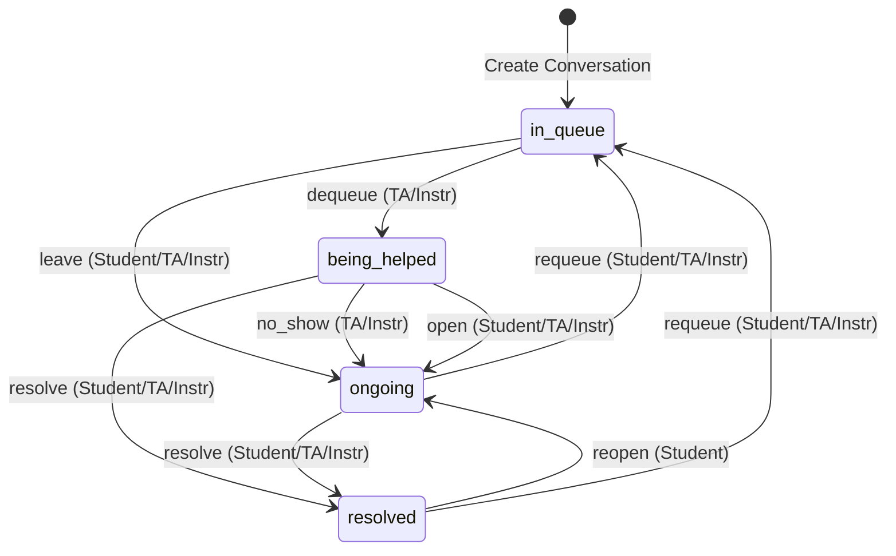

# Understanding Conversations

This document describes the lifecycle of a Conversation in Quuly, including the legal state transitions, the interactions that cause them, and the permissions required for each action.

## Conversation States

A conversation can be in one of the following states:

*   **`in_queue`**: The student is waiting for help. This is the initial state when a conversation is created.
*   **`being_helped`**: A TA or Instructor has dequeued the student and is currently assisting them.
*   **`ongoing`**: The conversation is active but not currently in the queue or being helped. This happens if a student leaves the queue, or if a session ends without resolution (e.g., "no show" or "open").
*   **`resolved`**: The conversation has been completed and closed.

## State Transitions

The state of a conversation is determined by the most recent **Interaction**. The following table and diagram describe the legal transitions.

### Transition Diagram

### Interaction Types and Transitions

| Interaction | Current State | New State | Description | Permissions |
| :--- | :--- | :--- | :--- | :--- |
| **`enqueue`** | `(new)` | `in_queue` | Initial creation of a help request. | Student |
| **`dequeue`** | `in_queue` | `being_helped` | A TA or Instructor starts helping the student. | TA, Instructor |
| **`leave`** | `in_queue` | `ongoing` | The student leaves the queue before being helped. | Student, TA, Instructor |
| **`no_show`** | `being_helped` | `ongoing` | The student was not present when dequeued. | TA, Instructor |
| **`open`** | `being_helped` | `ongoing` | The session ended without a resolution (e.g., "done for now"). | Student, TA, Instructor |
| **`resolve`** | `being_helped`, `ongoing` | `resolved` | The help request was successfully resolved. | Student, TA, Instructor |
| **`reopen`** | `resolved` | `ongoing` | A student reopens a closed conversation. | Student |
| **`requeue`** | `ongoing`, `resolved` | `in_queue` | The conversation is placed back in the queue. | Student, TA, Instructor |

## Technical Implementation

The state machine is enforced in the backend code:

*   **Database**: `zion-db/initdb/30_create_conversational_tables.sql` defines the `conversation_state` and `interaction_typ` enums.
*   **Logic**: `zion/data/conversation/conversation_state_graph.go` defines the `interactionGraph` (valid transitions) and `interactionPermissions` (who can perform them).
*   **Service**: `zion/data/conversation/conversation_service.go` uses `ApplyConversationInteraction` to validate and execute these transitions.

### Permissions Key
*   **Student**: The creator of the conversation.
*   **TA**: A teaching assistant for the course.
*   **Instructor**: An instructor for the course.

## Frontend Constraints

While the backend permissions are permissive (e.g., allowing TAs to `requeue`), the Frontend UI (`acadia`) imposes practical limits on what actions are available based on what the user can *see* and *interact with*.

### Summary of Effective UI Permissions

| State | Action | Student | TA / Instructor |
| :--- | :--- | :--- | :--- |
| **`in_queue`** | `leave` | ✅ Yes | ❌ No (Can only `dequeue`) |
| **`in_queue`** | `dequeue` | N/A | ✅ Yes |
| **`being_helped`** | `resolve` | ✅ Yes | ✅ Yes |
| **`being_helped`** | `open` (return to student) | N/A | ✅ Yes |
| **`ongoing`** | `requeue` | ✅ Yes | ❌ **No** (Hidden/Read-only) |
| **`ongoing`** | `resolve` | ✅ Yes | ❌ **No** (Hidden/Read-only) |
| **`resolved`** | `reopen` | ✅ Yes | N/A |
| **`resolved`** | `requeue` | ✅ Yes | ❌ **No** (Read-only) |

### Detailed Analysis

1.  **The "Requeue" Case (Ongoing → In Queue)**
    *   **Backend**: TAs are permitted to `requeue`.
    *   **Frontend**: TAs cannot perform this. `ongoing` conversations are **not visible** in the Staff Dashboard (`UnifiedInbox`). While they are visible in the Student History view (`UserDrilldownView`), they are rendered as **read-only** (no action buttons).

2.  **The "Resolve" Case (Ongoing → Resolved)**
    *   **Backend**: TAs are permitted to `resolve`.
    *   **Frontend**: TAs cannot perform this. Similar to `requeue`, TAs have no UI access to action buttons for `ongoing` conversations.

3.  **The "Requeue" Case (Resolved → In Queue)**
    *   **Backend**: TAs are permitted to `requeue`.
    *   **Frontend**: TAs cannot perform this. `resolved` conversations are visible in history views, but are always rendered as **read-only**.

**Conclusion**: In the current UI, only the **Student** can change the state of a conversation once it has reached `ongoing` or `resolved`. TAs can only act on conversations that are `in_queue` or `being_helped`.
