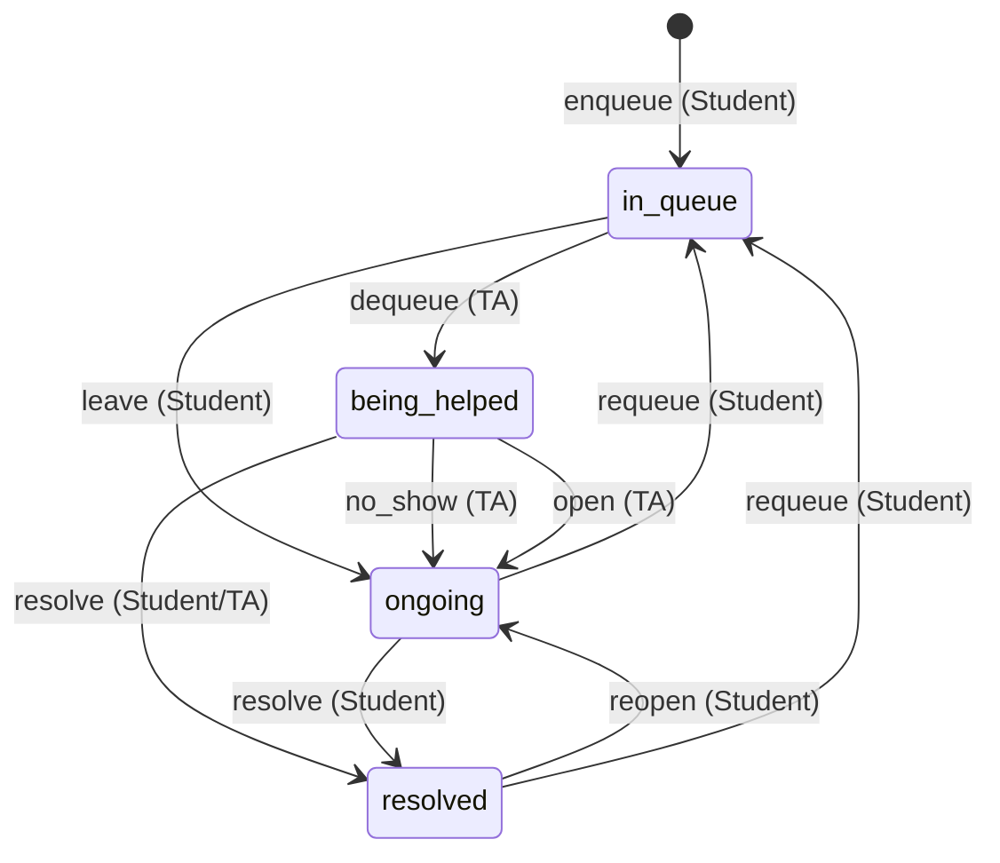

# Updating Conversations

This document describes planned changes to how conversations and interactions are managed in Quuly, including schema changes, new Redis caching, and bug fixes.

## Summary of Planned Changes

1. **Normalize the database schema**: Move per-queue-entry data (`room_id`, `location`, `description`) from `conversations` to `interactions` table
2. **Remove `state` from conversations**: State is derived from the most recent interaction; add `most_recent_interaction_id` for optimistic locking
3. **Add Redis caching**: Cache conversation state in Redis to avoid joins on every read
4. **Fix permission bugs**: Restrict TA permissions and add responder checks
5. **Fix queue race conditions**: Ensure Redis queue removal is validated before database updates

---

# Part 1: Updated Documentation

This section describes the system after all planned changes are implemented.

## State Diagram



**Notes**:
- "TA" includes Instructors
- TA transitions from `being_helped` can only be performed by the TA who dequeued the student (the current responder)
- TAs cannot act on conversations in `ongoing` or `resolved` states

## Interaction Permissions

| Interaction | From State | Student | TA (any) | TA (current responder) |
|-------------|------------|---------|----------|------------------------|
| `enqueue` | (new) | ✅ | ❌ | N/A |
| `dequeue` | `in_queue` | ❌ | ✅ | N/A |
| `leave` | `in_queue` | ✅ | ❌ | N/A |
| `no_show` | `being_helped` | ❌ | ❌ | ✅ |
| `open` | `being_helped` | ❌ | ❌ | ✅ |
| `resolve` | `being_helped` | ✅ | ❌ | ✅ |
| `resolve` | `ongoing` | ✅ | ❌ | ❌ |
| `reopen` | `resolved` | ✅ | ❌ | ❌ |
| `requeue` | `ongoing` | ✅ | ❌ | ❌ |
| `requeue` | `resolved` | ✅ | ❌ | ❌ |

## Database Schema

### `conversations` Table

| Field | Set At | Modified | Description |
|-------|--------|----------|-------------|
| `id` | Creation | Never | Primary key, generated by `generate_uid()` |
| `course_id` | Creation | Never | Foreign key to the course |
| `initiator_id` | Creation | Never | The student who created the help request |
| `topic` | Creation | Never | Brief summary of the help request |
| `created` | Creation | Never | Timestamp when conversation was created |
| `most_recent_interaction_id` | Creation | Yes | Foreign key to interactions, used for optimistic locking |

**Removed fields**:
- `state` - now derived from `most_recent_interaction_id`
- `room_id` - now stored per-interaction for `enqueue`/`requeue`
- `location` - now stored per-interaction for `enqueue`/`requeue`
- `description` - now stored in `interactions.comment_data` for `enqueue`/`requeue`

### `interactions` Table

| Field | Description |
|-------|-------------|
| `id` | Primary key |
| `conversation_id` | Foreign key to conversations |
| `typ` | Interaction type (enqueue, dequeue, leave, etc.) |
| `state` | **NEW**: Resulting conversation state (populated by trigger) |
| `responder_id` | User who performed this interaction (student or TA, despite the name) |
| `created` | Timestamp |
| `comment_data` | Optional context; currently allowed on any interaction type, but primarily used for "steps tried" on enqueue/requeue |
| `room_id` | **NEW**: Room for this queue entry (enqueue/requeue only, NULL otherwise) |
| `location` | **NEW**: Student's location in the room (enqueue/requeue only, NULL otherwise) |

### Interaction Type to State Mapping

The `state` column is automatically populated by a database trigger based on `typ`:

| Interaction `typ` | Resulting `state` |
|-------------------|-------------------|
| `enqueue` | `in_queue` |
| `requeue` | `in_queue` |
| `dequeue` | `being_helped` |
| `leave` | `ongoing` |
| `no_show` | `ongoing` |
| `open` | `ongoing` |
| `resolve` | `resolved` |
| `reopen` | `ongoing` |

### Why Remove `state` from Conversations?

1. **Single source of truth**: The interaction history is the real source of truth; `state` was denormalized
2. **`most_recent_interaction_id` is sufficient**: Can always derive state by looking up that interaction
3. **Redis handles the hot path**: Active conversations are cached; database joins only happen on cache miss
4. **Simpler writes**: One less field to update in the transaction

## Redis Cache

### Conversation Cache Structure

```
Conversation:{id} -> {
  state: "being_helped",
  most_recent_interaction_id: "abc123",
  room_id: "...",
  location: "...",
  description: "...",
  responder_id: "...",
  last_interaction_created: "2025-12-08T19:13:23Z"
}
```

### Cache Behavior

**Read path (cache hit):**
1. Get `state`, `most_recent_interaction_id`, and other fields from Redis
2. No database query needed

**Read path (cache miss):**
1. Query database with join to get current state + most recent interaction
2. Populate Redis cache
3. Return data

**Write path:**
1. Get current state from Redis (or DB on cache miss)
2. Validate transition is legal
3. Insert new interaction in DB transaction
4. Update conversation with optimistic lock on `most_recent_interaction_id`
5. If lock fails (0 rows updated), rollback and invalidate cache
6. On success, commit and update Redis cache (write-through)

### Cache Scope

- **Active conversations** (`in_queue`, `being_helped`): Always cached
- **Recently touched** (`ongoing` within last few hours): Cached with TTL
- **Resolved/old**: Not cached, fetched from DB on demand

### Queue Management (Existing)

Redis sorted sets continue to manage the queue:
```
Queue{course_id}:room_id -> sorted set of conversation IDs by enqueue time
```

---

# Part 2: Code Changes Required

## Change 1: Replace `state` with `most_recent_interaction_id`

### Database Migration

```sql
-- Add the new column
ALTER TABLE conversations
ADD COLUMN most_recent_interaction_id VARCHAR(32) REFERENCES interactions(id);

-- Populate for existing conversations
UPDATE conversations c
SET most_recent_interaction_id = (
    SELECT id FROM interactions
    WHERE conversation_id = c.id
    ORDER BY created DESC
    LIMIT 1
);

ALTER TABLE conversations
ALTER COLUMN most_recent_interaction_id SET NOT NULL;

-- Remove state column (after verifying migration and updating code)
ALTER TABLE conversations DROP COLUMN state;
```

### Update `ApplyConversationInteraction`

**File**: `zion/data/conversation/conversation_service.go`

Current code:
```go
convoSQL, convoParams := util.Update("conversations").
    Set("state", state).
    Where("id", conversationID).
    Create()
```

New code:
```go
// Insert the new interaction first
var newInteractionID string
err = tx.QueryRow(interactionSQL, conversationID, interactionType, userID, comment).Scan(&newInteractionID, &created)

// Update conversation with optimistic lock (no state field - it's derived)
result, err := tx.Exec(`
    UPDATE conversations
    SET most_recent_interaction_id = $1
    WHERE id = $2 AND most_recent_interaction_id = $3`,
    newInteractionID, conversationID, previousInteractionID)

rowsAffected, _ := result.RowsAffected()
if rowsAffected == 0 {
    tx.Rollback()
    return fmt.Errorf("Conversation was modified, please retry")
}
```

### Add `state` Column and Trigger to Interactions

Add a trigger to automatically populate `state` based on `typ`:

```sql
-- Add state column to interactions
ALTER TABLE interactions
ADD COLUMN state conversation_state;

-- Create function to derive state from typ
CREATE OR REPLACE FUNCTION set_interaction_state()
RETURNS TRIGGER AS $$
BEGIN
    NEW.state := CASE NEW.typ
        WHEN 'enqueue' THEN 'in_queue'
        WHEN 'requeue' THEN 'in_queue'
        WHEN 'dequeue' THEN 'being_helped'
        WHEN 'leave' THEN 'ongoing'
        WHEN 'no_show' THEN 'ongoing'
        WHEN 'open' THEN 'ongoing'
        WHEN 'resolve' THEN 'resolved'
        WHEN 'reopen' THEN 'ongoing'
    END;
    RETURN NEW;
END;
$$ LANGUAGE plpgsql;

-- Create trigger to run on insert
CREATE TRIGGER interaction_state_trigger
BEFORE INSERT ON interactions
FOR EACH ROW
EXECUTE FUNCTION set_interaction_state();

-- Populate state for existing interactions
UPDATE interactions SET state = CASE typ
    WHEN 'enqueue' THEN 'in_queue'
    WHEN 'requeue' THEN 'in_queue'
    WHEN 'dequeue' THEN 'being_helped'
    WHEN 'leave' THEN 'ongoing'
    WHEN 'no_show' THEN 'ongoing'
    WHEN 'open' THEN 'ongoing'
    WHEN 'resolve' THEN 'resolved'
    WHEN 'reopen' THEN 'ongoing'
END::conversation_state;

-- Make state NOT NULL after populating
ALTER TABLE interactions
ALTER COLUMN state SET NOT NULL;
```

### Update Queries That Filter by State

Queries are now simpler - just join and filter on `state`:

```sql
-- Old
SELECT * FROM conversations WHERE state = 'in_queue'

-- New
SELECT c.* FROM conversations c
JOIN interactions i ON i.id = c.most_recent_interaction_id
WHERE i.state = 'in_queue'
```

## Change 2: Move Per-Queue-Entry Data to Interactions

### Database Migration

```sql
ALTER TABLE interactions
ADD COLUMN room_id VARCHAR(32) REFERENCES rooms(id),
ADD COLUMN location VARCHAR(200);

-- Migrate existing data: copy from conversations to their enqueue interactions
UPDATE interactions i
SET room_id = c.room_id, location = c.location
FROM conversations c
WHERE i.conversation_id = c.id AND i.typ = 'enqueue';

-- Remove from conversations (after verifying migration)
ALTER TABLE conversations DROP COLUMN room_id;
ALTER TABLE conversations DROP COLUMN location;
ALTER TABLE conversations DROP COLUMN description;
```

### Update Queue Creation

**File**: `zion/data/queue/queue_service.go`

Update `InsertAndReturnConversations` to store `room_id`, `location`, and description in the interaction:

```go
convoSQL := `INSERT INTO conversations (course_id, initiator_id, topic)
             VALUES ($1, $2, $3) RETURNING id, ...`

interactionSQL := `INSERT INTO interactions
    (conversation_id, typ, responder_id, room_id, location, comment_data)
    VALUES ($1, $2, $3, $4, $5, $6)`
```

### Update Requeue Handling

**File**: `zion/data/conversation/conversation_service.go`

When handling `requeue`, allow specifying new `room_id` and `location`:

```go
if interactionType == interaction.REQUEUE {
    // Insert interaction with new room/location
    interactionSQL := `INSERT INTO interactions
        (conversation_id, typ, responder_id, room_id, location, comment_data)
        VALUES ($1, $2, $3, $4, $5, $6)`
}
```

## Change 3: Add Responder Check for `being_helped` State

**File**: `zion/data/conversation/conversation_service.go`

Add check in `ApplyConversationInteraction`:

```go
if conversation.State == BEING_HELPED && enrollmentData.Type != enrollment.STUDENT {
    currentResponder, err := c.GetCurrentResponder(conversationID)
    if err != nil {
        return err
    }
    if currentResponder == nil || currentResponder.ID != userID {
        return INVALID_TRANSITION_ERROR
    }
}
```

## Change 4: Restrict TA Permissions

**File**: `zion/data/conversation/conversation_state_graph.go`

Update `interactionPermissions`:

```go
var interactionPermissions = map[interaction.InteractionType]int{
    interaction.DEQUEUE: userBitmap[enrollment.INSTRUCTOR] | userBitmap[enrollment.TA],
    interaction.NO_SHOW: userBitmap[enrollment.TA] | userBitmap[enrollment.INSTRUCTOR],
    interaction.LEAVE:   userBitmap[enrollment.STUDENT],  // Changed: Student only
    interaction.OPEN:    userBitmap[enrollment.TA] | userBitmap[enrollment.INSTRUCTOR],  // Changed: TA only
    interaction.RESOLVE: userBitmap[enrollment.STUDENT] | userBitmap[enrollment.TA] | userBitmap[enrollment.INSTRUCTOR],
    interaction.REOPEN:  userBitmap[enrollment.STUDENT],
    interaction.REQUEUE: userBitmap[enrollment.STUDENT],  // Changed: Student only
}
```

**Note**: Additional state-based checks are needed (see Change 3) since `resolve` from `being_helped` allows TA but `resolve` from `ongoing` does not.

## Change 5: Fix Queue Race Condition

**File**: `zion/redis/queues.go`

Update `Remove` to return whether removal succeeded:

```go
func (p *PushClient) Remove(courseID, roomID, conversationID string) (bool, error) {
    if p.client == nil {
        return false, errors.New("Redis client is null")
    }
    res := p.client.ZRem(getQueueKey(courseID, roomID), conversationID)
    if res.Err() != nil {
        return false, res.Err()
    }
    return res.Val() > 0, nil
}
```

**File**: `zion/data/conversation/conversation_service.go`

Update caller to check result:

```go
if interactionType == interaction.LEAVE {
    removed, err := ctx.Value("pushClient").(*redis.PushClient).Remove(conversation.Course, conversation.Room, conversation.ID)
    if err != nil {
        return err
    }
    if !removed {
        return fmt.Errorf("Conversation is no longer in queue")
    }
}
```

## Change 6: Add Redis Conversation Cache

**File**: `zion/redis/conversations.go` (new file)

```go
type ConversationCache struct {
    State                   string `json:"state"`
    MostRecentInteractionID string `json:"most_recent_interaction_id"`
    RoomID                  string `json:"room_id"`
    Location                string `json:"location"`
    Description             string `json:"description"`
    ResponderID             string `json:"responder_id"`
    LastInteractionCreated  string `json:"last_interaction_created"`
}

func (p *PushClient) GetConversationCache(conversationID string) (*ConversationCache, error) {
    // Implementation using Redis HGETALL
}

func (p *PushClient) SetConversationCache(conversationID string, cache ConversationCache) error {
    // Implementation using Redis HSET with TTL
}

func (p *PushClient) InvalidateConversation(conversationID string) error {
    // Implementation using Redis DEL
}
```

## Change 7: Redis Queue Cleanup (Optional)

**File**: `zion/redis/queues.go`

Remove unnecessary `ZCard` check in `Dequeue`:

```go
func (p *PushClient) Dequeue(courseID, roomID string) (*string, error) {
    if p.client == nil {
        return nil, errors.New("Redis client is null")
    }
    // Remove ZCard check - ZPopMin handles empty queue
    convo := p.client.ZPopMin(getQueueKey(courseID, roomID), 1)
    values, err := convo.Result()
    if err != nil {
        return nil, err
    }
    if len(values) == 0 {
        return nil, nil
    }
    convoID, ok := values[0].Member.(string)
    if !ok {
        return nil, nil
    }
    return &convoID, nil
}
```

---

# Part 3: Future Considerations

## End of Office Hours Feature

Currently there is no good way to handle office hours ending with students still in queue. Options:

1. **New interaction type** (`dismiss`): Moves `in_queue` students to `ongoing` with a reason, allowing them to requeue later
2. **Bulk action**: Allow TAs to dismiss all remaining queue entries at once

## Invariant Checking

Implement runtime checks to verify consistency:

1. All conversations with `state = 'in_queue'` are in the corresponding Redis queue
2. All Redis queue entries have a matching conversation with `state = 'in_queue'`
3. For each `in_queue` conversation, the most recent interaction is `enqueue` or `requeue`

These could run in CI tests or periodically in production.
