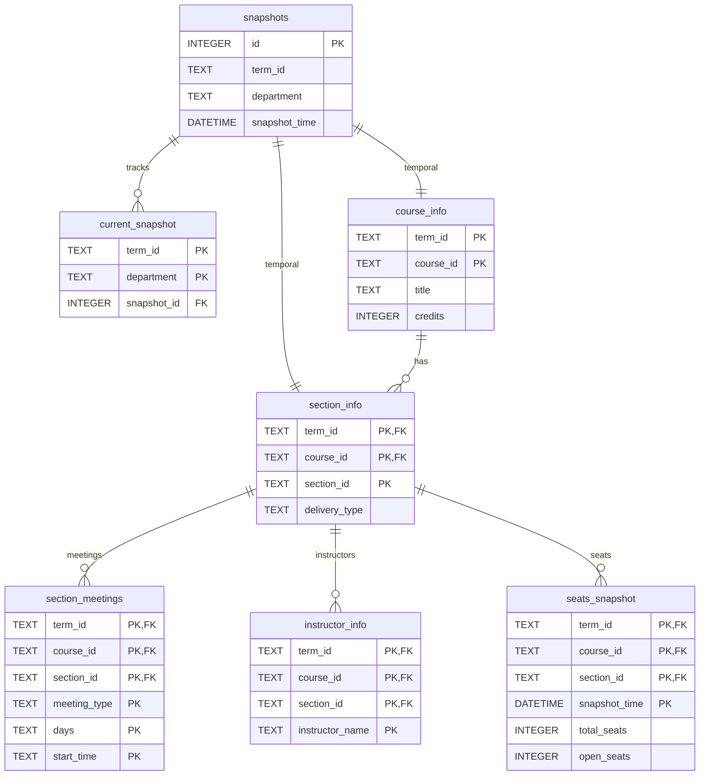

# Testudo Course Scanner Database Schema

## Key Relationships

- **snapshots → current_snapshot**: Tracks most recent snapshot per term/department (1:N)
- **snapshots → course_info, section_info**: Temporal tracking via first_seen/last_seen snapshot IDs
- **course_info → section_info**: One course has many sections (1:N)
- **section_info → section_meetings**: One section has multiple meeting times (1:N)
- **section_info → instructor_info**: One section has multiple instructors (1:N)
- **section_info → seats_snapshot**: One section tracked over time (1:N)

## Notes

- **Simplified View**: Only key fields shown. See `schema_diagram_complete.md` for all fields
- **Primary keys (PK)**: Uniquely identify each record
- **Foreign keys (FK)**: Link to parent tables
- **Temporal tracking**: All tables use `first_seen_snapshot_id` and `last_seen_snapshot_id` (not shown)
- **Generated fields**: `department` in course_info, `taken_seats` in seats_snapshot computed automatically
