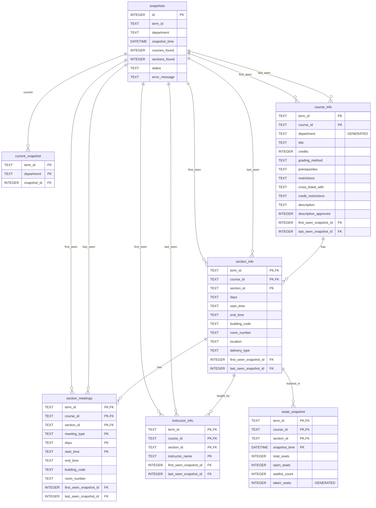

# Testudo Course Scanner Database Schema (Complete)

This diagram includes all fields, including the temporal tracking fields (first_seen/last_seen) used for historical data tracking.

## Key Relationships

- **snapshots → current_snapshot**: One snapshot can be current for many term/department combinations (1:N)
- **snapshots → course_info, section_info, etc.**: Snapshots track when records were first/last seen
- **course_info → section_info**: One course can have many sections (1:N)
- **section_info → section_meetings**: One section can have many meeting times (1:N)
- **section_info → instructor_info**: One section can have many instructors (1:N)
- **section_info → seats_snapshot**: One section can have many seat snapshots over time (1:N)

## Temporal Tracking

The `first_seen_snapshot_id` and `last_seen_snapshot_id` fields enable historical tracking:

- **first_seen_snapshot_id**: References the snapshot when a record first appeared in scraped data
- **last_seen_snapshot_id**: References the snapshot when a record was last seen in scraped data
- Records are never deleted, allowing tracking of when courses/sections were dropped or changed
- To find current/active records, query where `last_seen_snapshot_id` equals the current snapshot ID
- To find dropped records, query where `last_seen_snapshot_id` is less than the current snapshot ID
- Join with `snapshots` table to get the actual timestamps: `JOIN snapshots ON last_seen_snapshot_id = snapshots.id`

## Benefits of Snapshot IDs vs Timestamps

- **Referential integrity**: Foreign keys ensure first/last seen always reference actual snapshots
- **More compact storage**: INTEGER vs DATETIME
- **Simpler queries**: Direct comparison of IDs instead of timestamps
- **Better performance**: Indexed integer comparisons are faster than datetime comparisons

## Notes

- `snapshots` table tracks metadata about scraping operations
- `current_snapshot` table maintains the most recent snapshot for each term/department combination
- Primary keys (PK) are shown for each table
- Foreign keys (FK) show which fields link to parent tables
- GENERATED fields are automatically computed by the database (department, taken_seats)
- **section_meetings composite key**: The primary key includes `(meeting_type, days, start_time)` to allow sections to have multiple meetings of the same type (e.g., multiple labs at different times)
